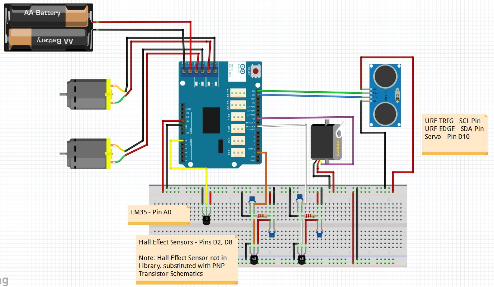

# Robot: CPEN 291 Project  
  
A copy of the private repository of the project created by Richard Tian, Sammy Brache, Zhihang Zhang, Amir Tootooni, Robin Reyes, and Johnny Ma
Core files are located in the "Main files" folder  
  
# Main Features:  
  * Robot has 3 modes: go straight, follow line and draw word 
  * Robot uses motors and hall effect sensors to move forward and keep straight 
  * Ultrasonic sensor used to detect walls and stop, then turns 90 degrees 
  * Piezo buzzer used to notify backing up 
  * Toggle switches used to switch modes 
  * Mirco switch with lever used to back up on collisions, uses interrupts 
  * Optical sensor to follow line 
  * Servo to move crayon up and down when drawing letters 
  
# Images  
  
  ## Robot 
   
   
   
   
   
  
  ## Fritzing diagram 
   
  
  ## Schematic diagram 
   
